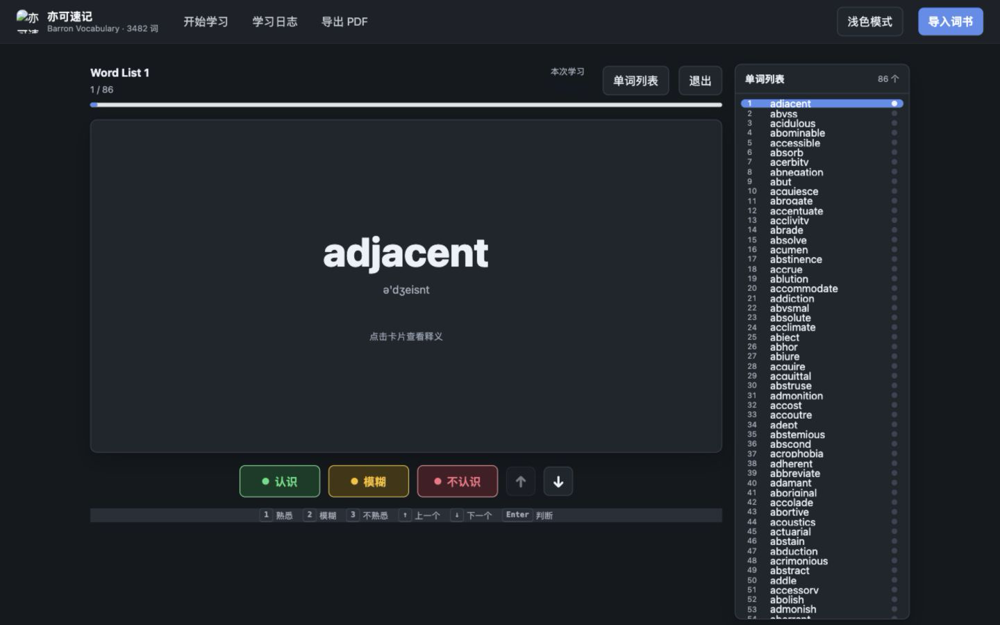
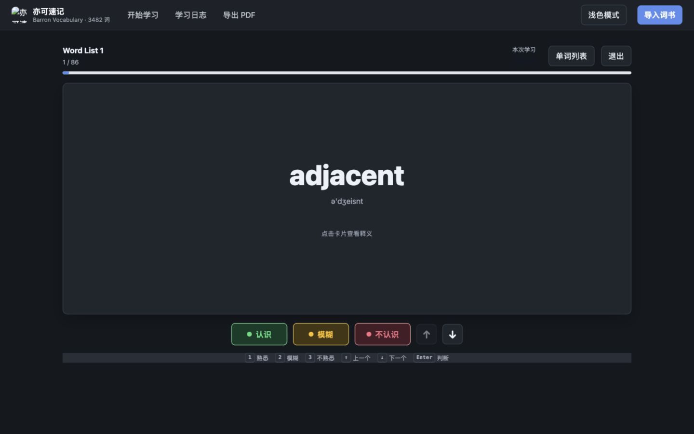
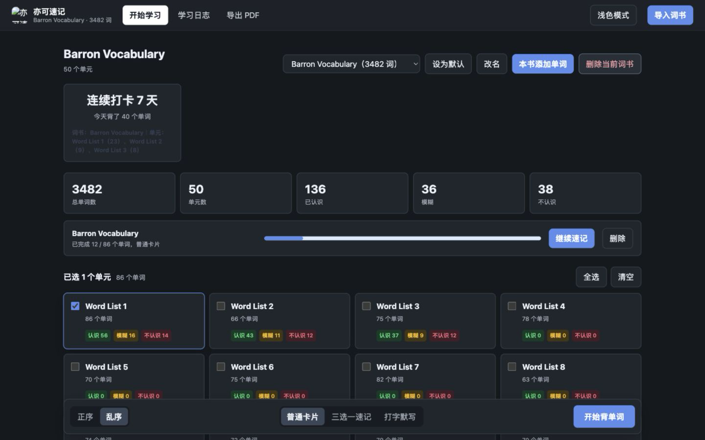
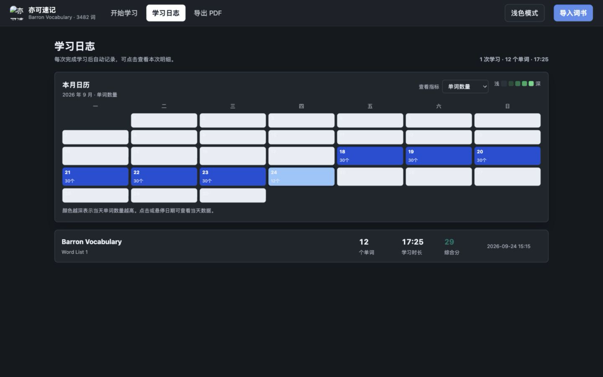
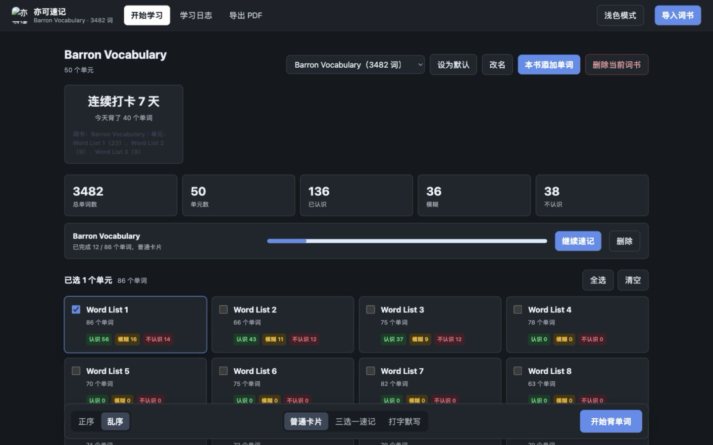
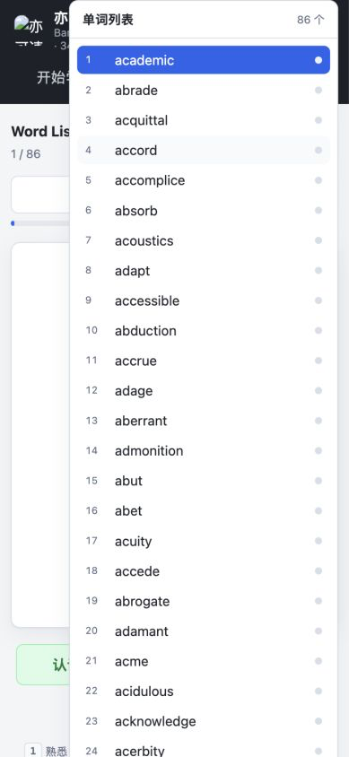

<div align="center">

# 亦可速记

### 本地优先的中英单词学习台

把词书、学习进度和复习记录留在自己的电脑上。背单词时，中央单词卡保持专注，右侧单词列表随时展开，当前单元的全貌一眼可见。

<p>
  <a href="https://github.com/chengyike20110519-create/Yike-Vocab/releases"><strong>下载一键启动包</strong></a>
  ·
  <a href="#界面预览">查看界面</a>
  ·
  <a href="#快速开始">开始使用</a>
</p>

<p>
  
  
  
</p>

</div>

<p align="center">
  
</p>

<p align="center"><sub>侧边栏可以打开或收回；它只占用侧面空间，不会让中间单词卡消失。</sub></p>

## 为什么做它

很多背词工具只能让你一次看一个词，回看整单元时需要反复跳转。亦可速记把“当前要记的词”和“本单元的全貌”放在同一屏：你可以点击右侧任意单词跳转，也可以把侧边栏收回，继续专注当前卡片。

## Barron 示例数据

下面的界面来自一次独立生成的 Barron 展示数据：保留完整的 50 个单元和 3,482 个单词，并生成了最近 7 天的合成学习日志。它只用于让大家在 GitHub 上直接看懂应用，不代表在线用户统计，也不是仓库内置数据库。

<div align="center">

| 词书 | 单元 | 单词 | 学习事件 |
| :---: | :---: | :---: | :---: |
| **1** | **50** | **3,482** | **210** |

</div>

仓库只发布程序和示例界面截图，不包含作者的词书、个人学习记录或 `data/vocab.db`。截图中的学习日志是合成数据；第一次运行时会在你自己的电脑上创建空数据库，导入自己的词书即可开始。

## 界面预览

### 背单词时的侧边单词列表

侧边栏是可选的：点击“单词列表”即可打开，再次点击即可收回。中间的单词卡始终保留；列表会展示当前单元的全部英文单词，并按学习状态标色，点击单词即可跳转。

<p align="center">
  
</p>

<table>
  <tr>
    <td width="50%" valign="top">
      <strong>单词卡学习</strong><br>
      
    </td>
    <td width="50%" valign="top">
      <strong>词书管理</strong><br>
      
    </td>
  </tr>
  <tr>
    <td width="50%" valign="top">
      <strong>学习日志</strong><br>
      
    </td>
    <td width="50%" valign="top">
      <strong>深色模式</strong><br>
      
    </td>
  </tr>
</table>

<p align="center">
  
</p>
<p align="center"><sub>手机端会把单词列表变成抽屉，不遮挡主要学习区域。</sub></p>

## 核心功能

### 一套连续的学习流程

- **导入词书**：支持 PDF、Excel、CSV、TXT、JSON、DOCX，也可以直接粘贴文本。
- **识别单元**：每个 Excel 工作表可作为一个单元，也支持在同一张表里使用“单元”列。
- **普通速记**：正序或乱序浏览单词卡，可上一张、下一张，也可切换三选一速记。
- **侧边列表**：在保持中间单词卡的同时，打开或收回当前单元的完整英文单词列表；点击列表项即可跳转。
- **断点续接**：自动记住每本词书的上次进度和顺序，下次打开可以继续。
- **键盘操作**：空格翻面，`1` / `2` / `3` 快速标记认识、模糊、不认识。

### 让复习结果可追踪

- **学习状态**：记录认识、模糊、不认识三种状态，以及每次点击的时间和次数。
- **学习日志**：按月查看每天学习量，保留每一次标记记录。
- **分组复习**：按状态或单元筛选单词，直接开始针对性复习。
- **释义修正**：在单词卡和复习记录中直接修正中文释义。
- **PDF 导出**：导出默写版或中英对照版；默写版每页 50 个单词，只保留编号和英文。

### 本地数据与隐私

- 词库和点击记录保存在运行目录下的 `data/vocab.db`，不会被 Git 跟踪。
- 默认词书和未完成的速记进度保存在浏览器本地存储中。
- 删除 `data/` 即可清空本地词库和学习记录。
- 应用默认只监听 `127.0.0.1`，没有账号系统，不建议直接暴露到公网。

## 快速开始

### 方式一：下载一键启动包

前往 [GitHub Releases](https://github.com/chengyike20110519-create/Yike-Vocab/releases) 下载最新的 `亦可速记-一键启动包.zip`，解压后：

- **macOS / Linux**：双击 `启动.command`。macOS 第一次如果提示无法打开，可右键文件并选择“打开”。
- **Windows**：双击 `启动.bat`。

启动器会自动创建独立运行环境、安装依赖、启动本地服务并打开浏览器。电脑需要预先安装 Python 3.10 或更高版本；第一次启动需要联网安装依赖。

### 方式二：手动运行

需要 Python 3.10 或更高版本。

```bash
git clone https://github.com/chengyike20110519-create/Yike-Vocab.git
cd Yike-Vocab
python3 -m venv .venv
source .venv/bin/activate
python3 -m pip install -r requirements.txt
python3 app.py
```

Windows 激活虚拟环境：

```powershell
.venv\Scripts\activate
python app.py
```

启动后会自动打开本地页面。如果常用端口已被占用，程序会自动选择系统分配的空闲本地端口。

## 导入格式

Excel 推荐列名：

| 内容 | 支持的列名 |
| --- | --- |
| 单元 | `单元` / `Unit` |
| 单词 | `单词` / `word` |
| 音标 | `音标` / `phonetic` |
| 词性 | `词性` / `pos` |
| 中文释义 | `中文释义` / `释义` |
| 英文释义（可选） | `英文释义` / `meaning_en` |

粘贴文本支持类似格式：

```text
Unit 1
abandon [əˈbændən] vt. 放弃；抛弃
come up with 提出；想出
```

PDF 导入会识别常见的 Barron / Direct Hits 词书排版。扫描版且没有文字层的 PDF 无法解析，请先另存为文字版或转成 Excel / CSV。

## 项目结构

```text
.
├── app.py                  # 本地服务与 API
├── importer.py             # 词书解析与导入
├── export_pdf.py           # PDF 导出
├── 启动.command             # macOS / Linux 一键启动
├── 启动.bat                 # Windows 一键启动
├── 亦可速记-一键启动包.zip    # 可直接分发的本地启动包
├── static/
│   ├── index.html
│   ├── styles.css
│   └── app.js
├── docs/images/            # 界面截图
├── requirements.txt
├── LICENSE
└── README.md
```

## 技术栈

Python 标准库 HTTP 服务、SQLite、`openpyxl`、`pypdf`、`reportlab`，以及原生 HTML / CSS / JavaScript；没有前端框架，也不需要构建步骤。

## 许可证

MIT License。具体内容见 [LICENSE](LICENSE)。
